# Data Storage

There are two main drives for data storage:

| Usage Type   | Operational Usage                          | Analytical Usage                          |
|--------------|--------------------------------------------|-------------------------------------------|
| Purpose      | Day-to-day operations                      | Business insights and decision making     |
| Data Type    | Current, real-time data                    | Historical data                           |
| Data Volume  | Typically smaller, manageable volumes      | Large volumes of data                     |
| Access Speed | Fast access for immediate needs            | Optimized for complex queries and analysis|
| Examples     | Transaction processing, customer management| Data mining, reporting, trend analysis    |


For each, there's a different type of processing:

- **OLTP** (Online Transactional Processing)
- **OLAP** (Online Analytical Processing)


| Feature                | OLTP (Online Transactional Processing) | OLAP (Online Analytical Processing)       |
|------------------------|----------------------------------------|-------------------------------------------|
| Purpose                | Manage day-to-day operations           | Support complex analysis and decision making|
| Data Type              | Current, real-time data                | Historical, aggregated data               |
| Query Type             | Simple, standardized queries           | Complex queries involving aggregations    |
| Data Updates           | Frequent, short transactions           | Infrequent, bulk updates                  |
| Schema                 | Normalized for efficiency              | Denormalized for read performance         |
| Examples               | Order entry, retail sales              | Sales forecasting, market research        |
&nbsp;


# Data Warehouse

Where does a data warehouse fit in this?

## Single-Tier Architecture

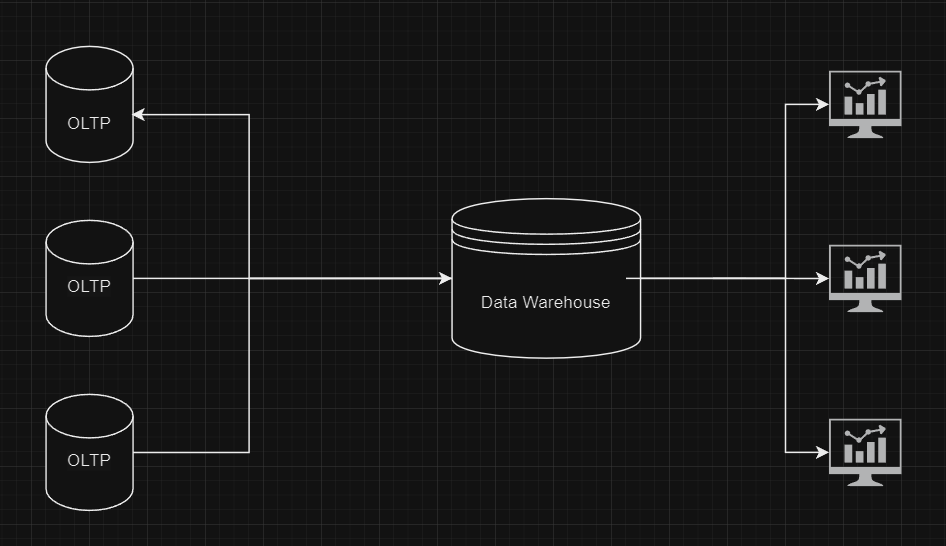

This is a the simplest architecture for a data warehouse system. Known as <b>Single-Tier Data Warehouse</b> Key challenges with this architecture are:
- Performance Issues (Seven - DB crashes)
- Scalability
- Not Flexible (Pre-defined schemas in the RDB for DW)

this is considered an OLTP + OLAP simple integration. Not a data warehouse in that sense.

** Here, Datawarehouse is considered the OLAP layer, the sources are the OLTP.


## Two-Tier Architecture

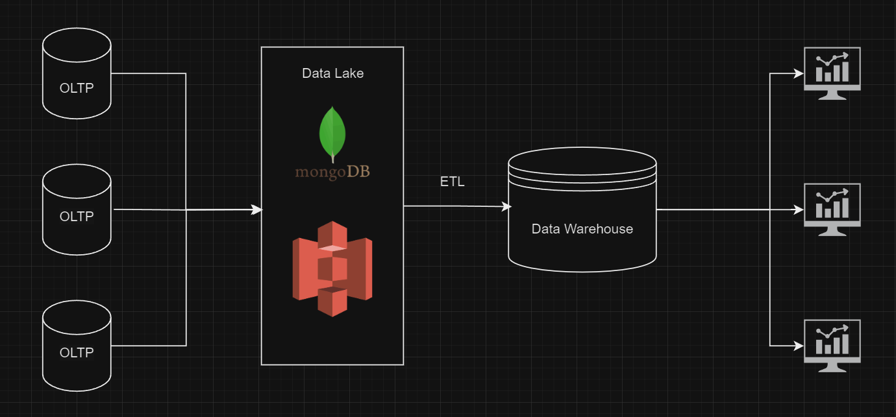

Adding an intermediate layer between data sources and data warehouse, storing the raw data, even unstructured or semi-structured. This gives us more flexibility with analyzing the data, as well as keeping track of the historical raw data.

- However, this adds complexity and running costs over the single-tier architecture. It also requires more effort for maintenance due to its more complex nature and increased system components.

## Three-Tier Architecture

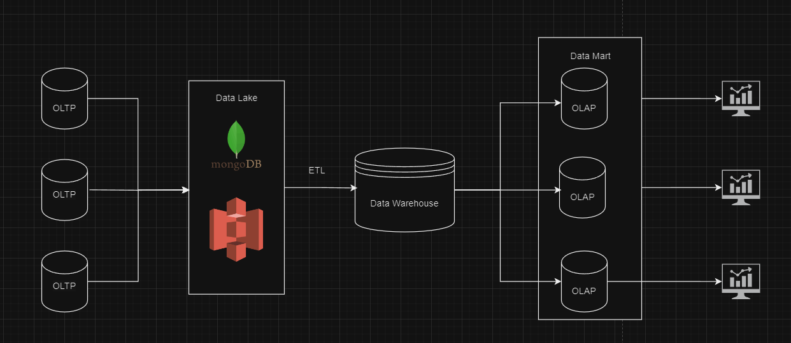

The most-used data warehouse architecture for larger enterprises with large amounts of data from various sources. 
However, it has the obvious drawbacks of being complex and costly as well as being the most demaing from a technical perspective. 

&nbsp;
&nbsp;


# Data Warehouse Layer

## Data Modeling
In data warehouses, a modeling technique called **Dimensional Modeling** is used to organize the data. 
Dimensional Modeling includes separating the data into:
- **Fact Tables**:
    - Contain quantitative data (measures) like sales amount, quantity sold.
- **Dimension Tables**:
    - Contain describtive attributes (dimensions) like time, geography, product

Both are linked via foreign keys. 
### Example Tables

#### Fact Table: Sales
| SaleID | ProductID | CustomerID | TimeID | Quantity | TotalAmount |
|--------|-----------|------------|--------|----------|-------------|
| 1      | 101       | 1001       | 202201 | 2        | 40.00       |
| 2      | 102       | 1002       | 202202 | 1        | 20.00       |
| 3      | 103       | 1003       | 202203 | 5        | 100.00      |

#### Dimension Table: Time
| TimeID | Date       | Month | Quarter | Year |
|--------|------------|-------|---------|------|
| 202201 | 2022-01-01 | Jan   | Q1      | 2022 |
| 202202 | 2022-02-01 | Feb   | Q1      | 2022 |
| 202203 | 2022-03-01 | Mar   | Q1      | 2022 |

#### Dimension Table: Customers
| CustomerID | Name       | Location   | Age |
|------------|------------|------------|-----|
| 1001       | John Doe   | New York   | 30  |
| 1002       | Jane Smith | Los Angeles| 25  |
| 1003       | Bob Brown  | Chicago    | 40  |


The way these tables are organized in the data warehouse define how our schema will be designed. 

## Schema Design

### Star Schema
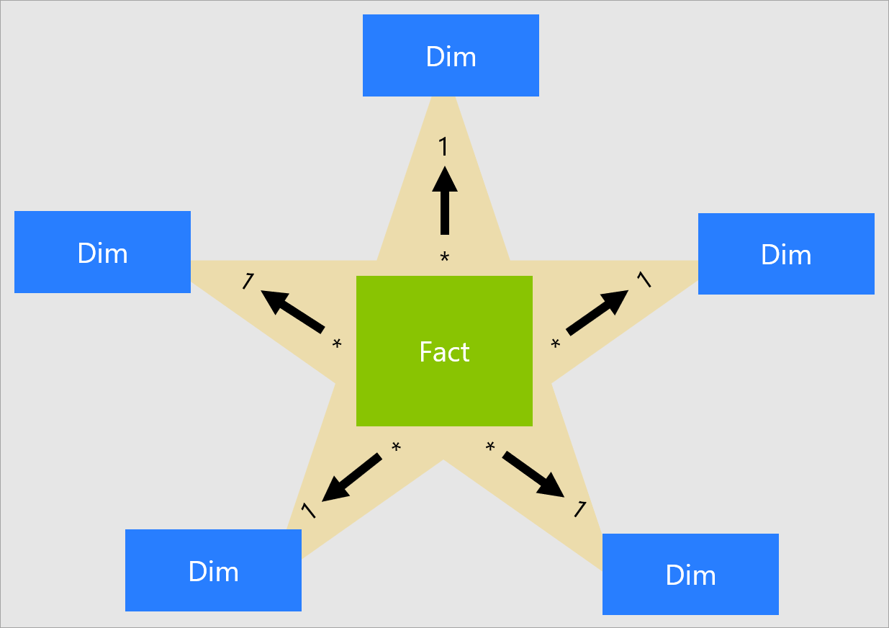

Star schema is the simplest form with a central fact table connected to multiple dimension tables.
It's easy to understand and query. 
However, in the star schema, the dimension table is not normalized. Since it's fact-centric, dimensions are designed to include everything for that specific fact record using only the foreign key. 

### Snowflake Schema

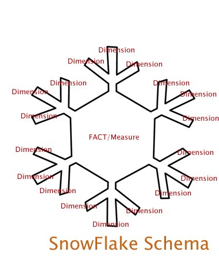
An extension of the star schema with normalized dimension tables.
reduces data redundancy but can be more complex, and leads to more complex joins (just like any normalization)


### Example Tables for Snowflake Schema

#### Fact Table: Sales
| SaleID | ProductID | CustomerID | TimeID | Quantity | TotalAmount |
|--------|-----------|------------|--------|----------|-------------|
| 1      | 101       | 1001       | 202201 | 2        | 40.00       |
| 2      | 102       | 1002       | 202202 | 1        | 20.00       |
| 3      | 103       | 1003       | 202203 | 5        | 100.00      |

#### Dimension Table: Time
| TimeID | Date       | MonthID | QuarterID | YearID |
|--------|------------|---------|-----------|--------|
| 202201 | 2022-01-01 | 1       | 1         | 2022   |
| 202202 | 2022-02-01 | 2       | 1         | 2022   |
| 202203 | 2022-03-01 | 3       | 1         | 2022   |

#### Dimension Table: Month
| MonthID | MonthName |
|---------|-----------|
| 1       | Jan       |
| 2       | Feb       |
| 3       | Mar       |

#### Dimension Table: Quarter
| QuarterID | QuarterName |
|-----------|-------------|
| 1         | Q1          |
| 2         | Q2          |
| 3         | Q3          |
| 4         | Q4          |

#### Dimension Table: Year
| YearID | Year |
|--------|------|
| 2022   | 2022 |
| 2023   | 2023 |

#### Dimension Table: Customers
| CustomerID | Name       | LocationID | Age |
|------------|------------|------------|-----|
| 1001       | John Doe   | 1          | 30  |
| 1002       | Jane Smith | 2          | 25  |
| 1003       | Bob Brown  | 3          | 40  |

#### Dimension Table: Location
| LocationID | City        |
|------------|-------------|
| 1          | New York    |
| 2          | Los Angeles |
| 3          | Chicago     |

&nbsp;
&nbsp;
&nbsp;

# Filesystems

Now we've covered how the data is stored on a logical level (Schema - Tables). But how is the data actually stored on disk? Here, **File systems** come into play.

## Postgres Physical Storage
The data files used by a database cluster are stored together within the cluster's data directory, commonly referred to as **PGDATA** 

For each database in the cluster, there is a subdirectory within PGDATA/base, named after the database's OID in pg_database. This subdirectory is the default location for the database's files.

```sql
SELECT oid, datname FROM pg_database;
```
this query lists all databases in our cluster, with their unique identifier. This identifier is then stored in **PGDATA/base/{OID}**
So now the question is how does Postgres 

actually read the data when a query is executed?


Every table stored as an array of pages of a fixed size (usually 8Kb). In a table, all the pages are logically equivalent, so a particular item (row) can be stored in any page.

The structure used to store the table is a heap file. Heap files are lists of unordered records of variable size. The heap file is structured as a collection of pages (or block), each containing a collection of items. The term item refers to a row that is stored on a page.

A page structure looks like the following:

### Terminology:
- **Tuple**: representation of the row in the database
- **Page Header**: 24 bytes long containing metadata information about the page
- **Page**: 8kb segment information 
&nbsp;
&nbsp;

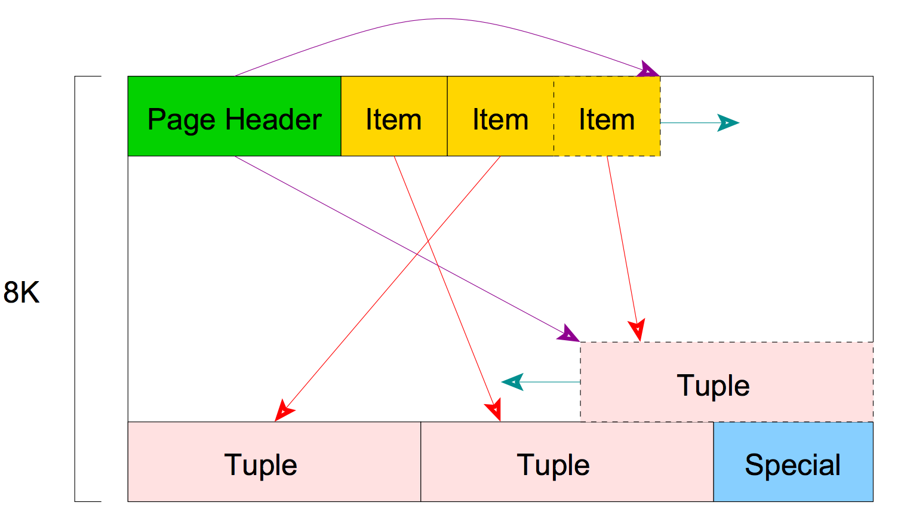


Big Data requires faster storage rate and speed. However, requests are always faster than storage rate and speed. To overcome this, we need to scale our system to match the demand. 

So, how can we scale this?


### Vertical Scaling vs Horizontal Scaling

When considering scaling options for data storage and processing, there are two primary approaches:

### Vertical Scaling (Scale Up)

- **Definition**: Increasing the capacity of a single server (e.g., adding more CPU, RAM, or storage).
- **Advantages**:
    - Simplicity: Easier to implement and manage.
    - Consistency: Single system, so no need for data distribution.
- **Disadvantages**:
    - Limited by hardware constraints.
    - Potentially higher cost for high-end hardware.
    - Single point of failure.


### Horizontal Scaling (Scale Out)

- **Definition**: Adding more servers to distribute the load.
- **Advantages**:
    - **Scalability**: Easier to scale out by adding more servers.
    - **Redundancy**: Multiple servers reduce the risk of a single point of failure.
    - **Cost-Effective**: Can use commodity hardware.
- **Disadvantages**:
    - **Complexity**: Requires more sophisticated management and data distribution.
    - **Consistency**: Ensuring data consistency across multiple servers can be challenging.
    - **Fault Tolerance**: Failure is proportional to the number of instances.

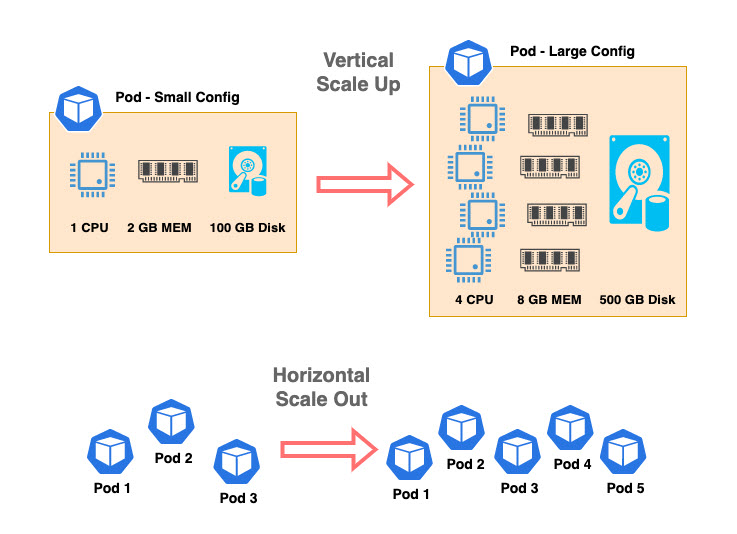

### Key Challenges:
- **Scalability**: RDBMS are designed for vertical scaling.
- **Concurrency**: Due to the ACID - Isolation nature of the RDBMS, concurrency is a challenge with high velocity data.
- **I/O Limitations**: Data retrieval is always limited due to its reliance on disk I/O operations.

So, it seems like the sclaing out is the logical direction we should head towards. 
But can't Postgres scale out? Actually, it can through **partiotioning**.

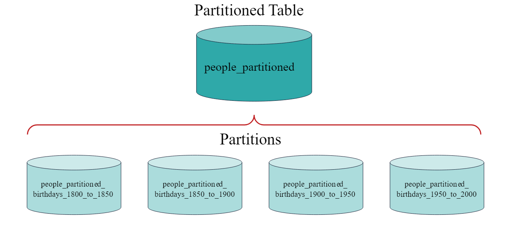

However, it will still have the same three issues mentioned above due to the ACID - Atomicity nature, as well as sequential reads from the master node.

Here, Hadoop comes into play. 


## Hadoop Distributed Filesystem (HDFS)

Since its original release, Hadoop has evolved beyond batch processing. Indeed the term Hadoop is sometimes used to refer to a larger ecosystem, not just HDFS.

### HDFS Design

HDFS is designed for storing very large files with streaming data access (Write once, Read Multiple times) patterns running on clusters of commodity hardware. 

HDFS has a master/slave architecture. An HDFS cluster consists of a single NameNode, a master server that manages the file system namespace and regulates access to files by clients. In addition, there are a number of DataNodes, usually one per node in the cluster, which manage storage attached to the nodes that they run on.

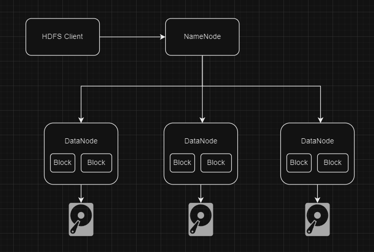

### HDFS Concepts
- **Blocks**:
A block is like the page in Postgres, however, it's by default 128MB, compared to 8KBs of Postgres. 
Why is it so large? To minimize the cost of seeks. It's optimized to make seek time 1% of transfer time (10ms -> 100MB/s). This makes storage management per blocks and not files, since files can span many disks and nodes.

- **Name Node**:
It manages the filesystem, maintaining the filesystem tree and metadata. It delegates and routes the requests to the respective data nodes. How does it route? To what data node? It stores what blocks each data node stores. (Edit Log / Namenode Log)

- **Data Node**:
Worker nodes, that maintain the data, reads and storesfrom the local disks.


But, how do we read the data from all these nodes? Why is it better than traditional RDBMS?


## Map Reduce

To speed up the processing, we need to run parts of the program in parallel. In theory, this is straightforward: we could process different years in different processes, using all the available hardware threads on a machine. There are a few problems with this, however.

- First, dividing the work into equal-size pieces isn’t always easy or obvious. In this case, the file size for different years varies widely, so some processes will finish much earlier than others. Even if they pick up further work, the whole run is dominated by the longest file. A better approach, although one that requires more work, is to split the input into fixed-size chunks and assign each chunk to a process.

- Second, combining the results from independent processes may require further processing. In this case, the result for each year is independent of other years, and they may be combined by concatenating all the results and sorting by year. For this example, data for a particular year will typically be split into several chunks, each processed independently. We’ll end up with the maximum temperature for each chunk, so the final step is to look for the highest of these maximums for each year.

- Third, you are still limited by the processing capacity of a single
machine. If the best time you can achieve is 20 minutes with the number of processors you have, then that’s it. You can’t make it go faster. Also, some datasets grow beyond the capacity of a single machine. When we start using multiple machines, a whole host of other factors come into play, mainly falling into the categories of coordination and reliability. Who runs the overall job? How do we deal with failed processes?

Here, We introduce MapReduce. A **programming model** that comes plugged with all functionalities needed for this specific kind of jobs. 

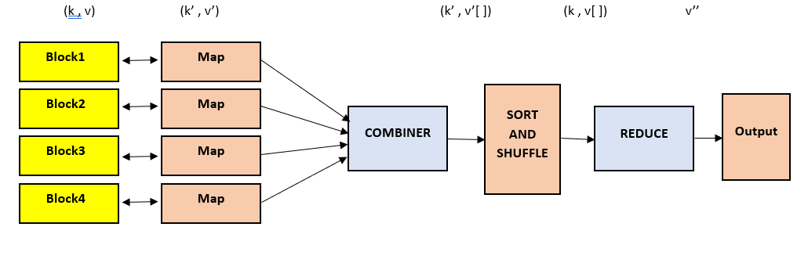


### Example: Item Purchases with MapReduce

### Input Data
```
1, 101, Electronics, 2, 300
2, 102, Clothing, 1, 50
1, 103, Electronics, 1, 200
3, 104, Groceries, 5, 20
2, 105, Clothing, 2, 75
3, 106, Groceries, 3, 15
```

### Map Phase
In the map phase, we will process each record to emit key-value pairs where the key is the `Category` and the value is the `Quantity`.

#### Map Output
```
Electronics, 2
Clothing, 1
Electronics, 1
Groceries, 5
Clothing, 2
Groceries, 3
```

### Shuffle and Sort Phase
In this phase, the MapReduce framework will group the values by key and sort them.

#### Shuffle and Sort Output
```
Clothing: [1, 2]
Electronics: [2, 1]
Groceries: [5, 3]
```

### Reduce Phase
In the reduce phase, we will sum the quantities for each category.

#### Reduce Output
```
Clothing, 3
Electronics, 3
Groceries, 8
```

### Final Output
The final output represents the total quantity of items purchased in each category.

```
Category, TotalQuantity
Clothing, 3
Electronics, 3
Groceries, 8
```

This is a very simple example using a single reducer. However, we have the flexibility to scale the number of map jobs as well as the reducer jobs. 
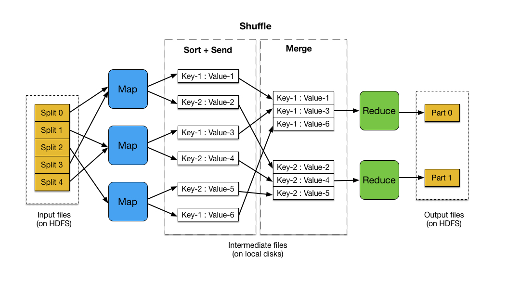

### Challenges of MapReduce
- **No SQL Support**
- **Batch Processing**


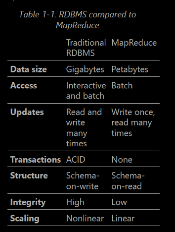


## YARN
just like we did with Postgres, going into details of how the data is actually read, we need to look into how the data is read from the HDFS by MapReduce. 

The MapReduce we discussed is the v2. of the MapReduce. Before 2012, with the HDFS v1. MapReduce had APIs for interacting directly with the filesystem to read the data. However, since the release of version 2 of HDFS, Hadoop introduce YARN (Yet Another Resource Negotiator), as a separating layer between any application in the Hadoop ecosystem and the actual HDFS. 
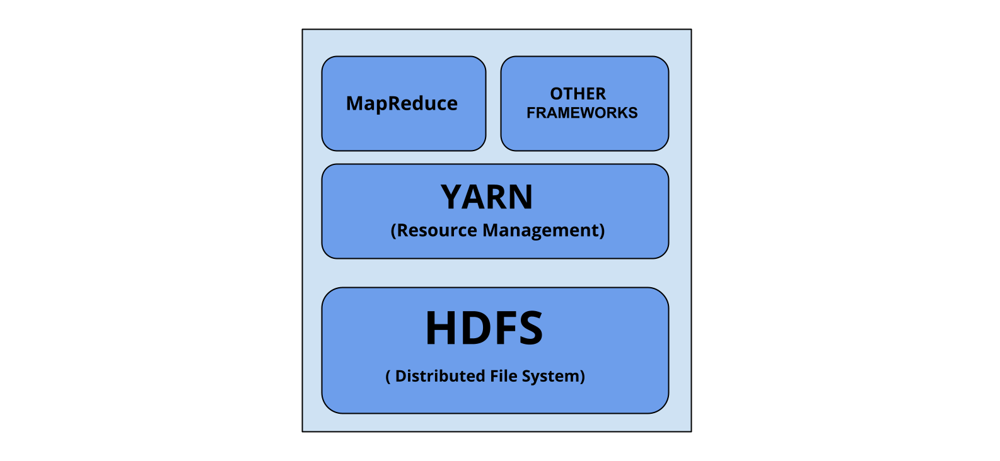

YARN acts as the cluster resource manager. It provides APIs for requesting and working with cluster resources, but these APIs are not exposed directly to the user code, but rather as part of the distributed computing framework (MapReduce, Spark, Hive, etc.)

### Anatomy of YARN Application

The fundamental idea of YARN is to split up the functionalities of resource management and job scheduling/monitoring into separate daemons. The idea is to have a global ResourceManager (RM) and per-application ApplicationMaster (AM). An application is either a single job or a DAG of jobs.

- **Resource Manager**: The master of the cluster. it decides which jobs run on which nodes. 

- **Node Manager**: The master of the node. Responsible for the container running on the node. Monitors their resource usage (cpu, memory, disk, network), reporting to the resource manager/Scheduler.


After, we write our code/query, we submit it to the cluster. YARN picks up the query, invokes the **Resource Manager** which checks the available nodes to pick up the job and execute it. How does it check it? Through **Node Managers** where a request-response cycle occurs for checking for data locality & available resources.


** Further readings: Scheduling types & modes. 


## HBase
As we discussed, MapReduce has the drawback of being bash-processing based. What if we need to interact with the data as a transactional one? 

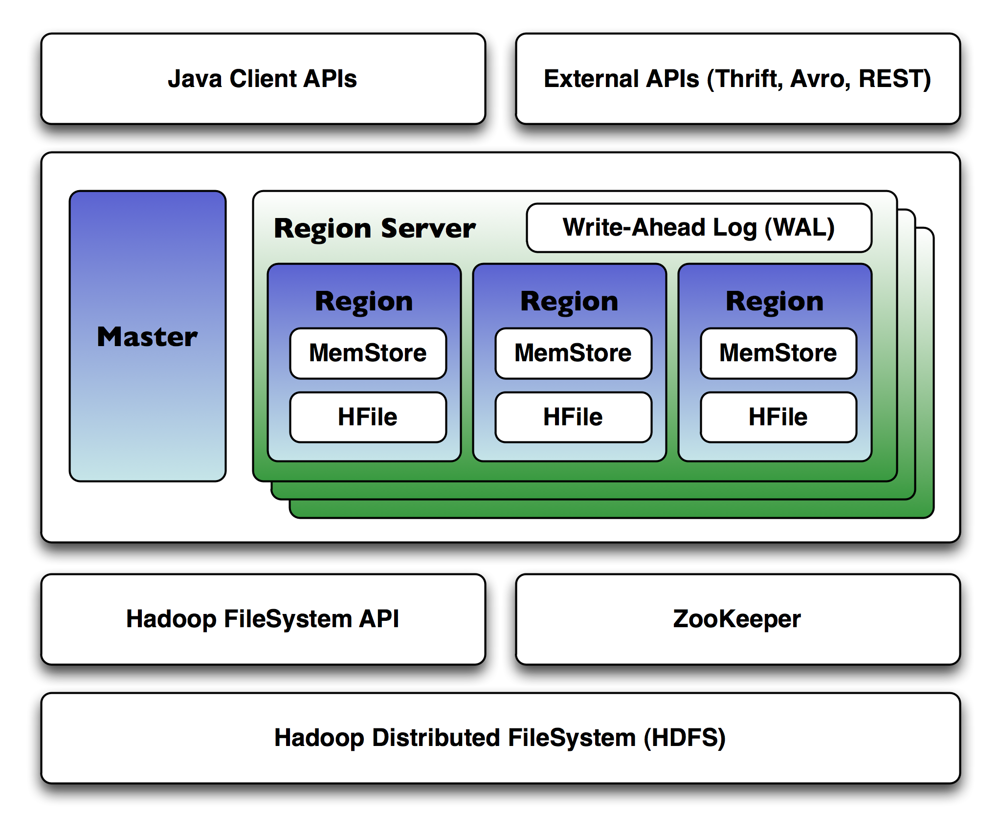

### What is HBase?

HBase is an open-source, distributed, scalable, and NoSQL database modeled after Google's Bigtable. It is designed to handle large amounts of sparse data, providing real-time read/write access to big data. HBase is built on top of the Hadoop Distributed File System (HDFS) and integrates seamlessly with Hadoop's ecosystem.

HBase is used to overcome the limitations of batch processing in MapReduce by providing real-time read/write access to data. useful for real-time read/write operations on large datasets. Allowing us to have an OLTP layer in our ecosystem, one that we can query and interact with for daily operations.

- **Time-series data storage and retrieval**
- **Real-time analytics**
- **Online transaction processing (OLTP)**
- **Storing and managing large-scale data for web applications**

### HBase Architecture

HBase has a master-slave architecture consisting of several key components:

1. **HBase Master**
2. **Region Servers**
3. **ZooKeeper**
4. **HDFS**

#### 1. HBase Master

- The HBase Master is responsible for managing the cluster, including the assignment of regions to Region Servers, load balancing, and handling schema changes.
- **Functions**:
    - Coordinates the Region Servers.
    - Manages metadata and schema operations.
    - Handles failover and recovery.

#### 2. Region Servers

- Region Servers handle read and write requests from clients. They manage regions, which are subsets of the table's data.
- **Functions**:
    - Serve data for read and write operations.
    - Split regions when they become too large.
    - Communicate with the HBase Master for region assignment and load balancing.

#### 3. ZooKeeper

- ZooKeeper is a distributed coordination service that manages configuration information, naming, and synchronization for HBase.
- **Functions**:
    - Keeps track of the live Region Servers.
    - Provides distributed synchronization.
    - Stores metadata about the cluster state.

### How HBase Solves Batch Processing Issues in MapReduce

HBase addresses the limitations of batch processing in MapReduce by enabling real-time read/write access to data. Here’s how it achieves this:

1. **Random Access**: Unlike HDFS, which is optimized for sequential access, HBase allows for random read/write access to data. This makes it suitable for applications that require quick lookups and updates.

2. **Low Latency**: HBase provides low-latency access to data, making it ideal for real-time applications. It achieves this through in-memory caching and efficient data retrieval mechanisms.

3. **Scalability**: HBase can scale horizontally by adding more Region Servers. This allows it to handle large datasets and high throughput.

So, HBase solves the issue of providing us with an OLTP for our data warehouse, but it's NoSQL. How can we have a SQL database for OLTP in our datawarehouse? A simple workaround is having processing pipeline that parses the output of the HBase queries, but this can not scale well.


## Spark
Apache spark can be considered an alternative to MapReduce in this ecosystem, by providing a more efficient data processing engine that can handle batch processing, real-time streaming, machine learning, and interactive queries - All within the Hadoop ecosystem.
Spark is originally a processing engine, it was then adopted into the hadoop ecosystem since it overcomes the challenges discussed in the MapReduce section. 
As well as providing high-level APIs for Java, Python, and R. It was then expanded, adding multiple layers to it such as: 

### Spark Architecture
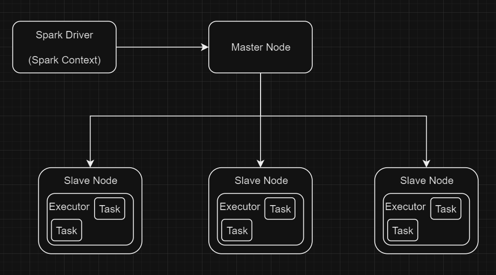
### Components of Spark - Standalone

1. **Driver Program**: The driver program runs the main function of the application and creates the SparkContext. It is responsible for converting the user program into tasks and scheduling them to run on the executor nodes.
In Hadoop, it connects to the Cluster Manager in YARN, to negotiate resources.

2. **Executors**: Executors are launched on worker nodes and are responsible for running the tasks assigned by the driver program. They also provide in-memory storage for RDDs that are cached by user programs.

3. **Tasks**: A task is a unit of work that is sent to one executor. Each task operates on a partition of the data.

### Workflow of a Spark Job
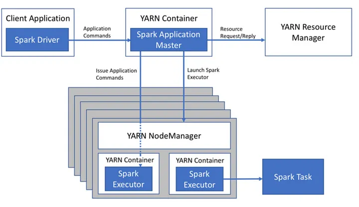
1. **Job Submission**: The user submits a Spark application using the `spark-submit` command. The application code contains the logic for data processing.

2. **SparkContext Creation**: The driver program initializes a SparkContext, which is the entry point for Spark functionality. The SparkContext connects to the cluster manager (such as YARN, Kubernetes, or standalone master node). It communicates for assigning worker nodes. A special resource for Spark is called RDD for in-memory data storage for faster processing.

3. **Resource Allocation**: The cluster manager allocates resources (CPU, memory) for the Spark application. It launches executors on the worker nodes.

4. **Task Scheduling**: The driver program creates a logical plan for the job, constructing a DAG of stages representing the job stages (like Airflow). The tasks are scheduled to run on the executors based on the cluster manager assignment.

5. **Data Processing**: The executors execute the tasks on the data partitions. Intermediate results can be stored in memory for fast access.

6. **Result Collection**: The results of the tasks are sent back to the driver program. The driver program combines the results and performs any final operations.

### Spark in the Hadoop Ecosystem

Spark integrates seamlessly with other components of the Hadoop ecosystem:

- **HDFS**: Spark can read from and write to HDFS, allowing it to process large datasets stored in HDFS.
- **YARN**: Spark can run on YARN, leveraging YARN's resource management capabilities.
- **Hive**: Spark can run Hive queries using the HiveContext, allowing it to interact with Hive's metastore and query data stored in Hive tables.
- **HBase**: Spark can read from and write to HBase, enabling real-time data processing on HBase tables.
- **Kafka**: Spark can consume data from Kafka topics, allowing it to process streaming data in real-time.

By integrating with these components, Spark provides a powerful and flexible platform for big data processing and analytics.


## Hadoop Eco System Overview:
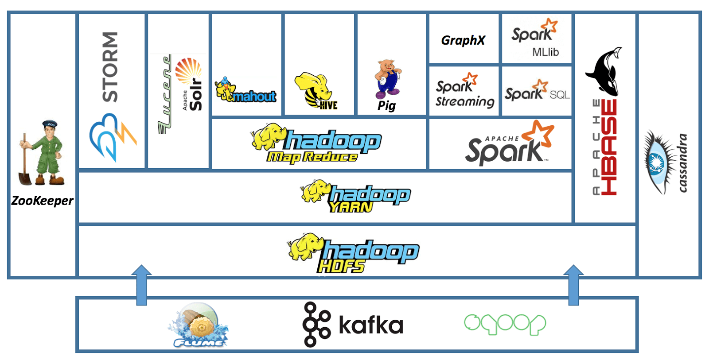

## Hadoop Ecosystem in Action:
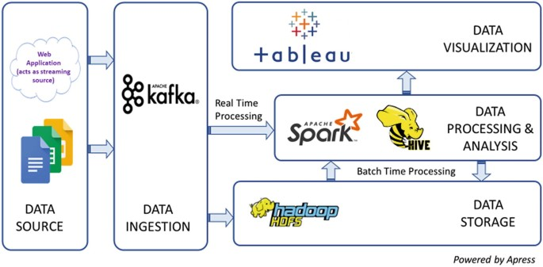

# Data Warehouse Solutions

There are multiple solutions available for data warehouses, spanning from free open-source projects like Hive & ClickHouse, to cloud-provided solutions like AWS Redshift & Azure Synapse.

## 1) Hive
Apache Hive is another tool in the Hadoop ecosystem built on top of HDFS, YARN, and MapReduce. 

As we discussed, since the Hadoop ecosystem is so distributed, each part of the ecosystem tries to fill a hole left by other parts. 
As mentioned in MapReduce, there's no sql support. It's a programming model, meaning if we want to query our data in the HDFS, we have to write a script or a complete program to achieve this. 
Hive provides us the querying functionality using a sql-like language called HiveQL

### Hive Architecture
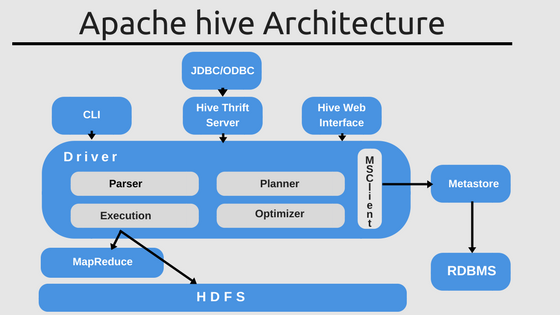

1. **Hive Client**:
    - **Role**: Provides an interface for users to interact with Hive. This can be through a command-line interface (CLI), web-based user interface (UI), or JDBC/ODBC drivers for connecting with other applications.

2. **Hive Services**:
    - **Driver**: Manages the lifecycle of a HiveQL query, including query compilation, optimization, and execution.
    - **Compiler**: Parses the HiveQL query, checks for syntax and semantic errors, and converts it into a directed acyclic graph (DAG) of map-reduce tasks.
    - **Execution Engine**: Executes the DAG of tasks in the correct order, interacting with Hadoop's YARN for resource allocation.
    - **Metastore**: Stores metadata about the tables, columns, data types, and the location of data in HDFS. It is crucial for query planning and optimization. It's usually a traditional RDBMS (Postgres/MySQL)

### Workflow of Query Execution

1. **Query Submission**: The user submits a HiveQL query through the Hive Client.
2. **Query Parsing**: The Driver receives the query and passes it to the Compiler.
3. **Query Compilation**: The Compiler parses the query, checks for errors, and converts it into a DAG of map-reduce tasks.
4. **Optimization**: The Compiler optimizes the DAG for efficient execution.
5. **Execution Plan**: The optimized DAG is passed to the Execution Engine.
6. **Resource Allocation**: The Execution Engine interacts with YARN to allocate resources for the tasks.
7. **Task Execution**: The tasks are executed in the correct order, reading from and writing to HDFS as needed.
8. **Result Retrieval**: The results are collected and returned to the user through the Hive Client.

So basically, Hive is a layer that lets us interact with HDFS/MapReduce using SQL-like queries. But does it have to be MapReduce? -> Further readings: Apache Tez

Hive is very popular due to its flexibility. As it can be used for all types of Datawarehouse architectures. Providing ultimate flexibility, in addition to many other tools in the Hadoop ecosystem that can handle all kinds of tasks related to data science (Spark/Kafka/...)

## 2) ClickHouse
Clickhouse is a column-oriented SQL DBMS. for OLAP (remember which tier for the datawarehouse architecture? Single-Tier)


### Column-Oriented SQL

Column-oriented databases store data by columns rather than by rows. This approach is particularly beneficial for analytical queries that aggregate data over many rows but only for a subset of columns. By storing each column separately, column-oriented databases can read only the necessary columns, reducing I/O and improving query performance.

#### Example: Item Purchases in Column-Oriented Storage

Consider the same example of item purchases:

| PurchaseID | ItemID | Category    | Quantity | Price |
|------------|--------|-------------|----------|-------|
| 1          | 101    | Electronics | 2        | 300   |
| 2          | 102    | Clothing    | 1        | 50    |
| 1          | 103    | Electronics | 1        | 200   |
| 3          | 104    | Groceries   | 5        | 20    |
| 2          | 105    | Clothing    | 2        | 75    |
| 3          | 106    | Groceries   | 3        | 15    |

In a column-oriented database, the data would be stored as follows:

- **PurchaseID Column**: [1, 2, 1, 3, 2, 3]
- **ItemID Column**: [101, 102, 103, 104, 105, 106]
- **Category Column**: [Electronics, Clothing, Electronics, Groceries, Clothing, Groceries]
- **Quantity Column**: [2, 1, 1, 5, 2, 3]
- **Price Column**: [300, 50, 200, 20, 75, 15]

This storage format allows for efficient querying of specific columns. For example, if we want to calculate the total quantity of items purchased in each category, the database can read only the **Category** and **Quantity** columns, ignoring the others.

** Can we apply map reduce here as a programming model? Yes! In fact, there's an Apache column-based DBMS known as ***Apache Cassandra*** which can be easily integrated into our hadoop ecosystem.


## 3) AWS Redshift
Redshift is a cloud-provided data warehouse solution provided by Amazon. It's a three-tier architecture, utilizing underlying AWS services for all the functionalities needed 

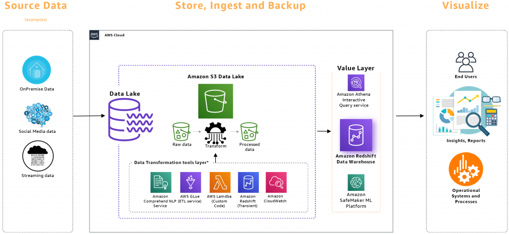

Redshift is based on a modified version of Postgres, that has all the partitioning, scalability handled completely by AWS. 
It ends up with a similar view to the HDFS complete ecosystem, with each component we discussed having an alternative in the AWS services. Like:
- HDFS - S3
- YARN - EMR
- Hive - Athena
- Pig - Glue
- HBase - DynamoDB


# Demo
Before diving into the demo, we need to understand Hadoop installation.
## Hadoop Installation

Hadoop has 3 types of installation modes:
    • Fully Distributed
    • Pseudo-Distributed
    • Standalone
    
The fully distributed is the production setup, whereas pseudo-distributed is good for development and testing.

### Fully Distributed Setup
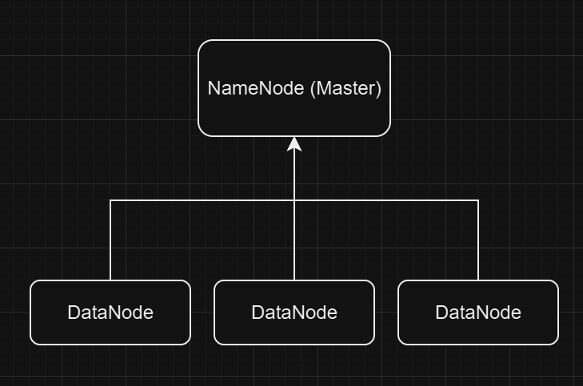

Both Pseudo-distributed and standalone installation have all system components on a single node. However, the way 
We setup this single node is the real distinction between both.

HDFS, and all its ecosystem components were written in Java, meaning that each node in the system needs a JVM to run on it. When choosing to put all on a single node, we have two options to configure the JVMs for the nodes:

### Standalone:
Uses a single JVM for all system components in the node.
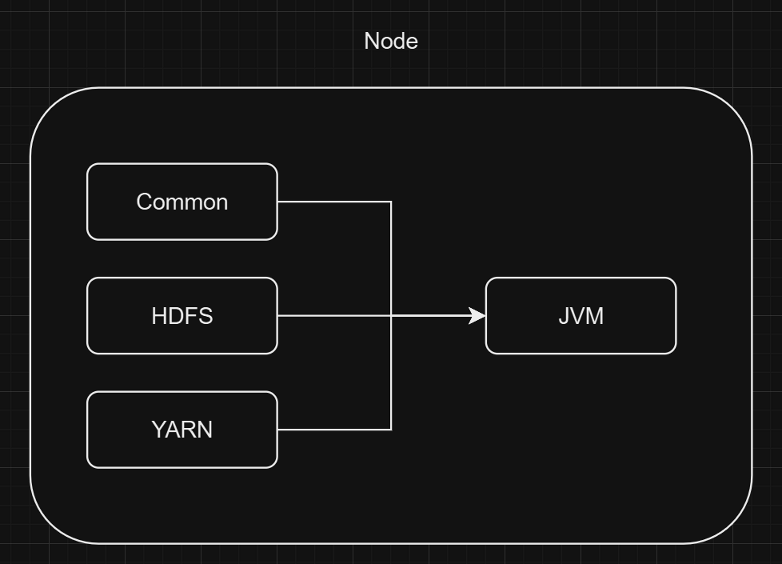

### Pseudo-Distributed:
Each System component has its own JVM.
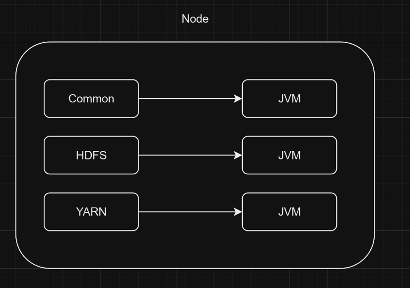

Naturally, since we're working on a single laptop, we'll have a demo for the pseudo-distributed installation uning Docker, where each component has its own JVM installed on its own Docker Image.

